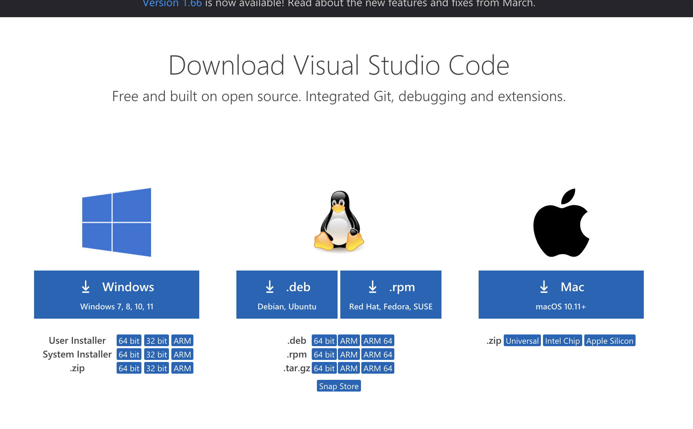
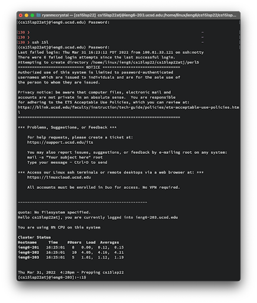
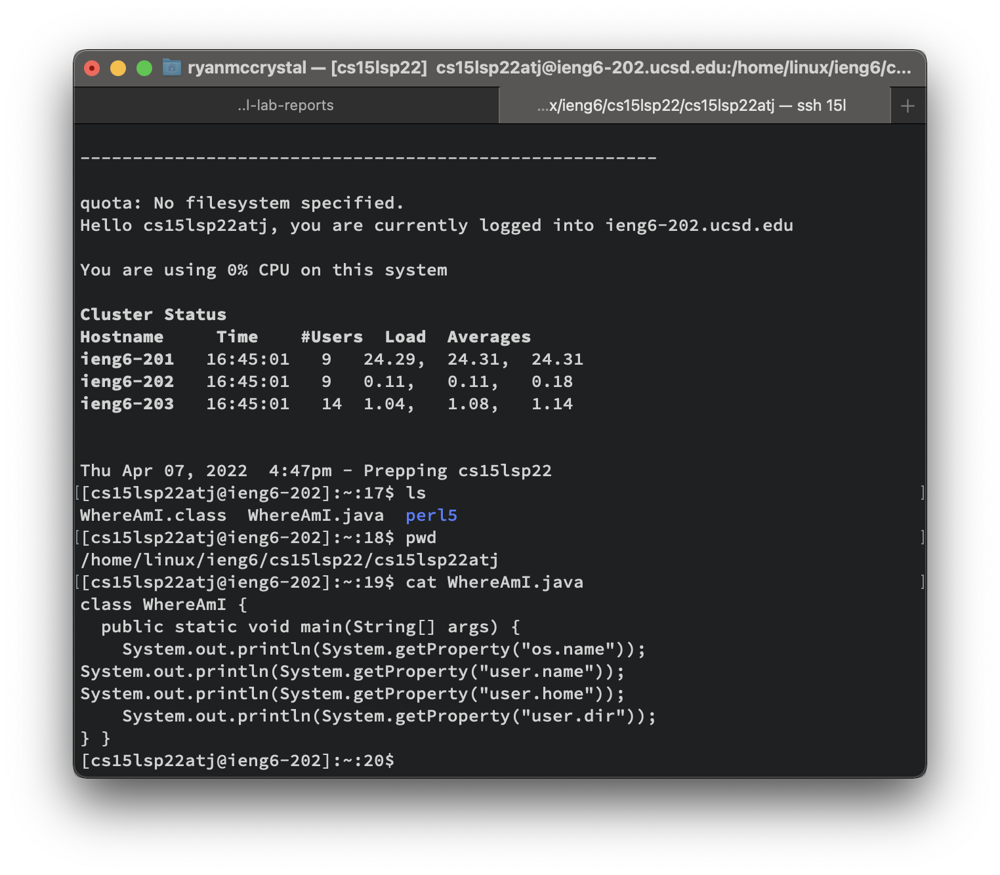
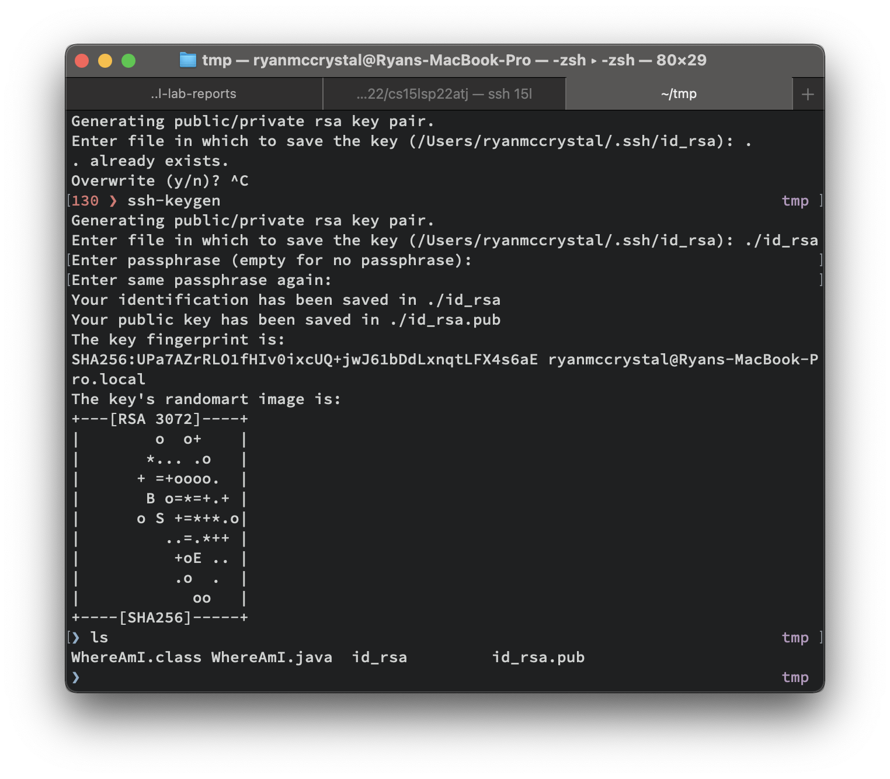
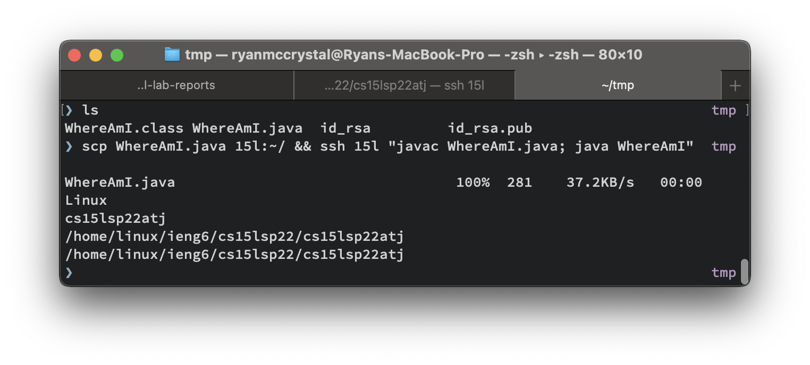

# Lab report 1

## Installing vscode
Download and install vscode from [here](https://code.visualstudio.com/download):


## Logging in to ieng6

To log into your course-specific account on ieng6, use ssh to remotely connect to the ieng6 server using your active directory using your username and password:



If you want you can edit your ~/.ssh/config file to automatically login using the alias `15l` like so:
```
Host 15l
	User cs15lsp22atj
	HostName ieng6.ucsd.edu 
	IdentityFile "~/Documents/UCSD/CSE 15L/ssh-keys/id_rsa"
```

## Commands
* ls: Lists all of the files in the current dir
* pwd: Prints the current working directory
* cat WhereAmI.java: Prints the contents of WhereAmI.java


## Moving files
You can move files to the server using the scp command
the syntax is `scp [localFile] [server]:[remoteFile]

For example:


This creates a new file on the local computer called hello.txt, moves it to the server, and prints the contents on the server

## Setting up an ssh key

You can create a new ssh key using `ssh-keygen`


This will create two files in the local directory: id_rsa and id_rsa.pub

we need to move id_rsa.pub into the remote directory ~/.ssh/authorized_keys, which we can do with scp:
```
scp ./id_rsa.pub 15l:~/.ssh/authorized_keys
```
now we can login to the server using `ssh -i id_rsa [remote]`

## Remote running
To quickly run WhereAmI.java on the server, we can run a command like so:

```
scp WhereAmI.java 15l:~/ && ssh 15l "javac WhereAmI.java; java WhereAmI"
```

This will move WhereAmI.java to the home directory on 15l, ssh into 15l and compile and run the file on the server

