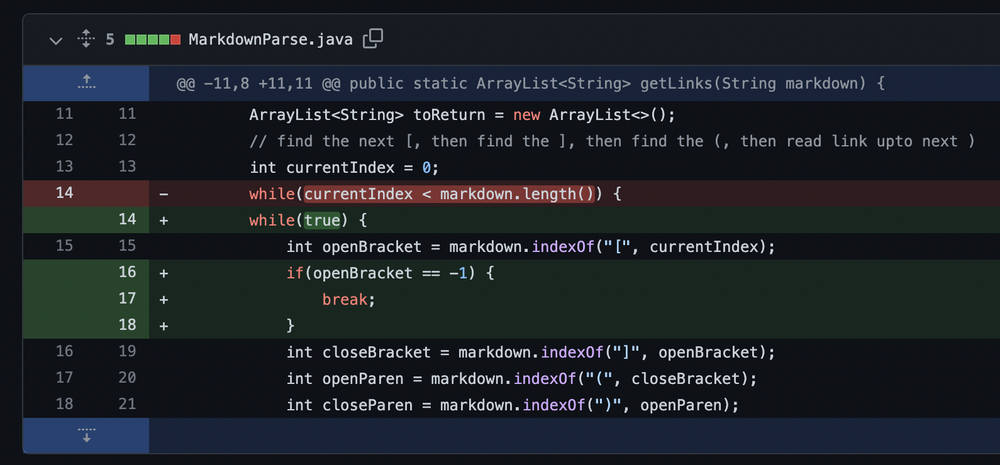
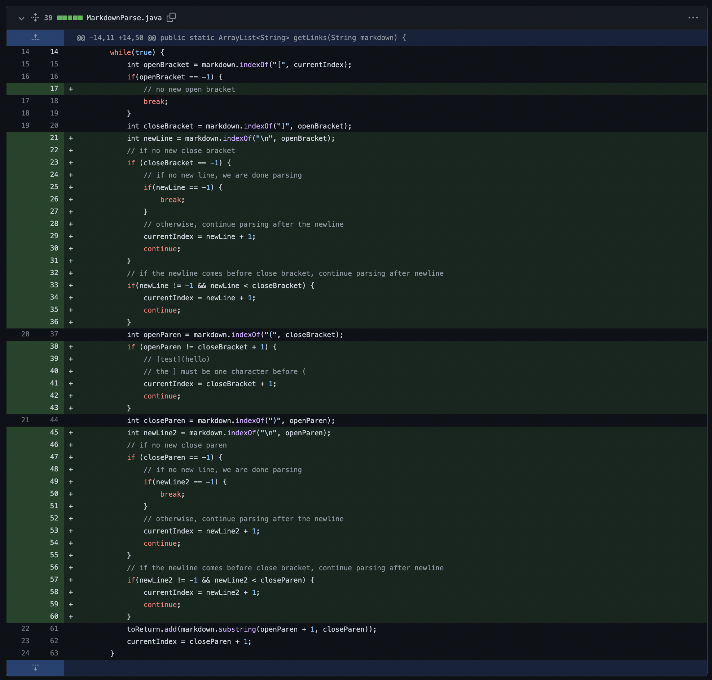
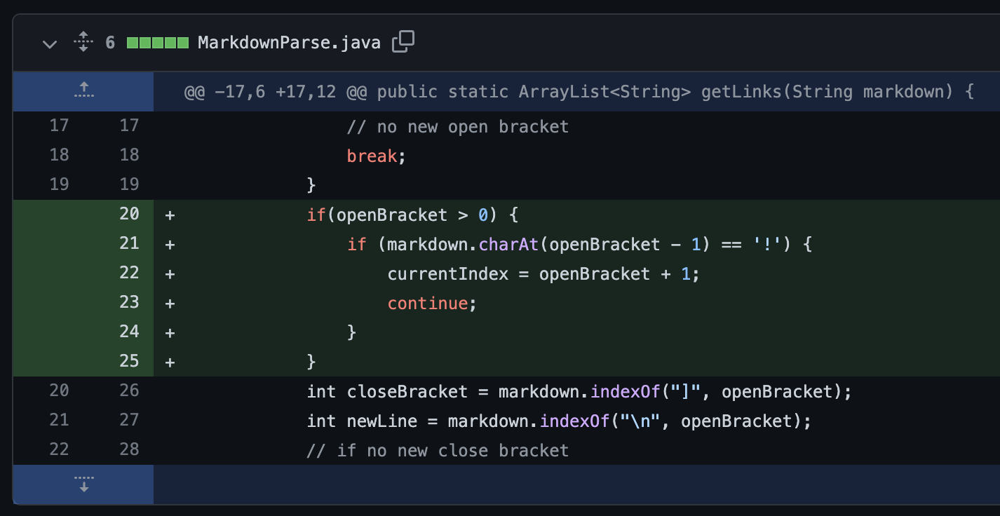

# Lab Report 2

## Change 1

[test-file.md](https://github.com/rmccrystal/markdown-parser/blob/edee6efdac99dd02e9ff0dc4d26147a66041fa11/test-file.md)

The issue was that the parser was looping infinitely because the loop
only ends if the closeBracket is the final token in the markdown file.
This was fixed by checking if the there is a open bracket and breaking
from the loop if there is not.

## Change 2

[new-test.md](https://github.com/rmccrystal/markdown-parser/blob/4b0d7331027eddcccf9a1c913b1b0df132239c39/new-test.md)

The symptom of the issue is that it was not recognizing pretty much
anything you give it so I just refactored the function with a bunch of checks.

Multiple changes were made in this commit:
1. Check if there is no new open bracket, and if so break from the loop
2. Check if the close bracket appears after a newline, if so continue parsing after the newline,
3. Check if the close bracket exists, if it’s not there continue after the newline, otherwise break
4. Check if the open paren appears right after the closing bracket
5. Steps 2 & 3 for parenthesis after parsing brackets

## Change 3

[new-test.md](https://github.com/rmccrystal/markdown-parser/blob/0cd984f676e0f8430c2ed138c4cc29ea1cdace4e/new-test.md)

The issue with the version before this commit is that it was recognizing images as links which it shouldn't do.
The bug was that this check didn't exist shown by the fact that it was recognizing images as links. I fixed this by
adding a check for the ! before the open bracket.
