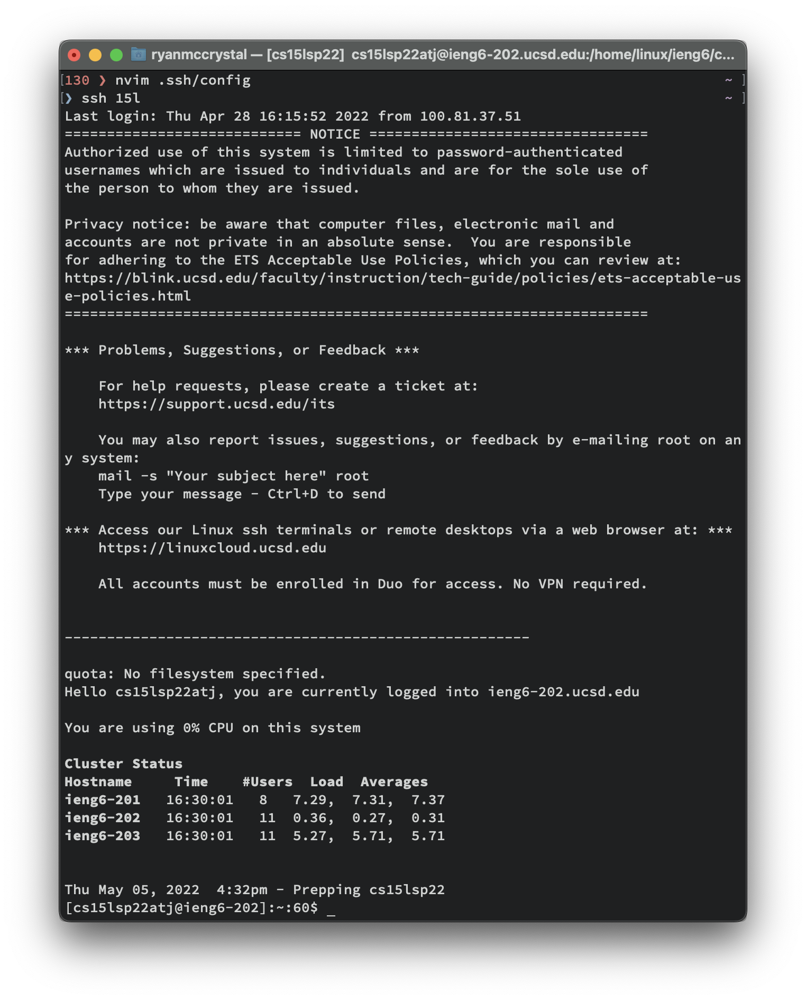
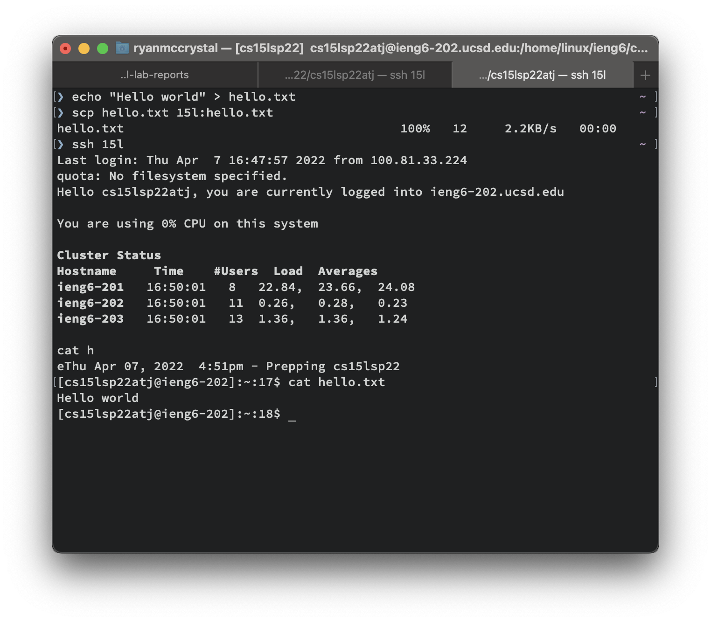
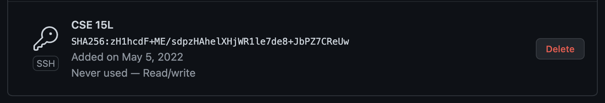
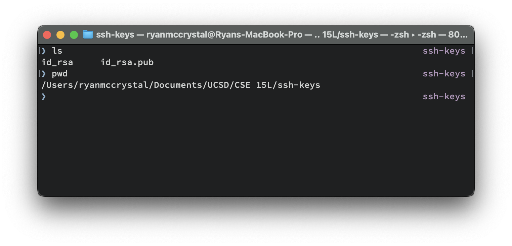
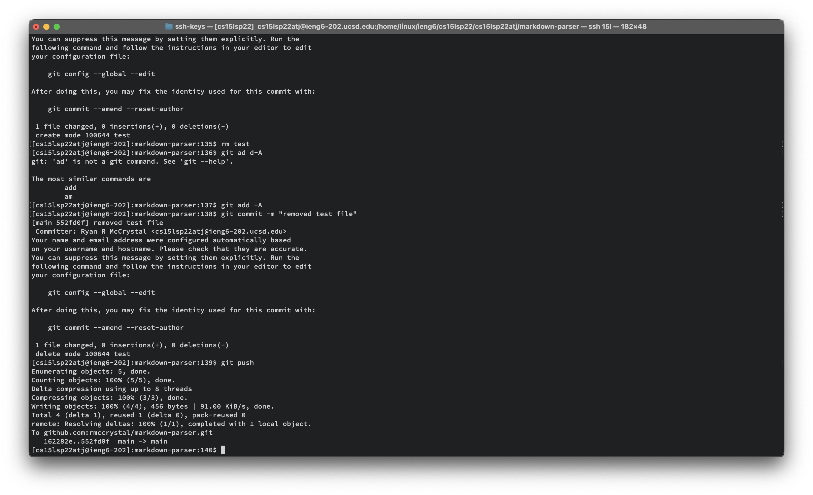
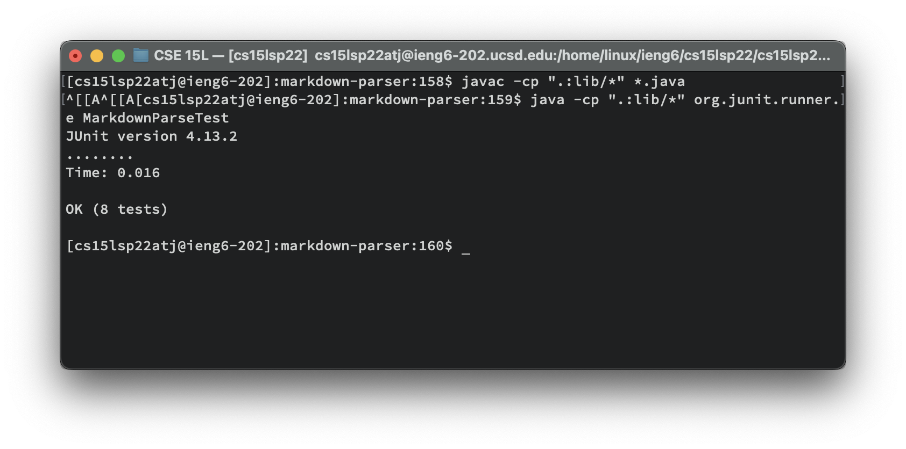
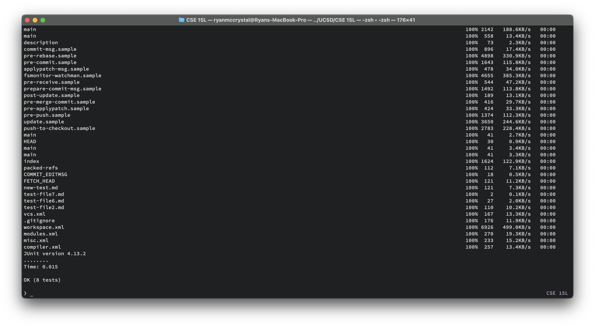

# Lab Report 3

## Streamlined ssh configuration
Here are the contents of the `.ssh/config` file:
```shell
Host 15l
	User cs15lsp22atj
	HostName ieng6.ucsd.edu 
	IdentityFile "~/Documents/UCSD/CSE 15L/ssh-keys/id_rsa"
```
The `Host` property determines the alias to use to select this ssh configuration

The `User` property determines the username to use when connecting to the server

The `HostName` property determines the hostname to connect to

The `IdentityFile` property determines the path to the private key to use when connecting to the server


To use this configuration, you can run the following command: `ssh 15l`


To transfer files using `scp` using the ssh configuration, you can run the following commands:


## Setup Github Access from ieng6
Create key on GitHub:

The corresponding private key is in this location:

Copy it over to the server using scp
```shell
scp id_rsa 15l:~/.ssh/id_rsa
```
Put the following contents into the `.ssh/config` file on the remote:
```shell
Host *
  IdentityFile ~/.ssh/id_rsa
```
Clone the repo, make a change, and push:

[Link to commit](https://github.com/rmccrystal/markdown-parser/commit/552fd0f1fc68fdd606c99ea501be8aef46d7a49c)

## Copying whole directories with `scp -r`
Copy the whole markdown-parser directory to the server:
```shell
scp -r markdown-parser 15l:~/markdown-parser
```

Run junit tests on the resulting directory:


These two tasks can be combined with the following command:
```shell
scp -r markdown-parser 15l:~/markdown-parser && ssh 15l "cd markdown-parser;/software/CSE/oracle-java-17/jdk-17.0.1/bin/javac -cp .:lib/* *.java;/software/CSE/oracle-java-17/jdk-17.0.1/bin/java -cp .:lib/* org.junit.runner.JUnitCore MarkdownParseTest"
```
