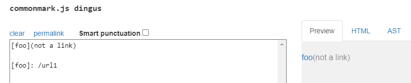
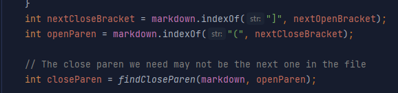
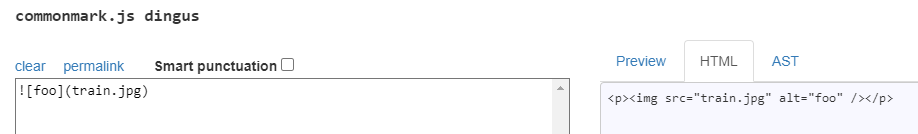
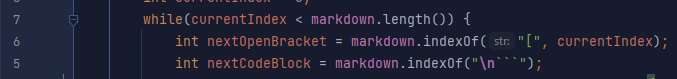

# Lab Report 5

### How did I find the tests with different results
I copied the answer MarkdownParse.java to my repo, iterated through all the files and found the files that produced different results.

### Link to test-file with different results
[567.md](https://github.com/rmccrystal/markdown-parser/tree/main/test-files/567.md)
[577.md](https://github.com/rmccrystal/markdown-parser/tree/main/test-files/577.md)

## Tests
### 567.md
The contents of 567.md are as follows:
```markdown
[foo](not a link)

[foo]: /url1
```

In the answer implementation, the getLinks method checks for spaces inside the link URLs, something I was not doing.
In this case, both implementations are incorrect

The following is the output of the program that compares the two implementations:
```
Result did not match for 567.md
Expected: []
Actual: [not a link]
```

According to commonmark, the only link that should exist is `/url1`:


Both implementations are incorrect in that they do not handle the other link format. The bug is that the implementation does not handle
the link format: `[foo]: https://url` that exists in the md spec. To solve this, the implementation should search not only for
an open parenthesis after a `[link]`, but also for a `:` in the case of this different format. After encountering a `:` immediately after
the `[link]`, the implementation should start parsing the link URL until it encounters a space or a newline.

Here is a screenshot of where this code should be added:


### 577.md
The contents of 577.md are as follows:
```markdown

```

According to Lab 3: markdown-parser should be "a program that takes a markdown file as a command line argument and
then prints out all of the URLs of the links (but not of images) in that file."

The answer implementation does not handle the case where a link is an image, while my implementation does.
In this case, my implementation is correct.

The following is the output of the program that compares the two implementations:
```
Result did not match for 577.md
Expected: [train.jpg]
Actual: []
```

According to commonmark, no links should exist:


For the answer implementation, the bug is that it does not check for an exclamation point before the `[link]`
To solve this, you could check for an exclamation point before the first `[`, skipping if the `[` is the first character.
This is to prevent checking an invalid index. If the `[` is for a link, we can skip to the close parenthesis and continue searching.
